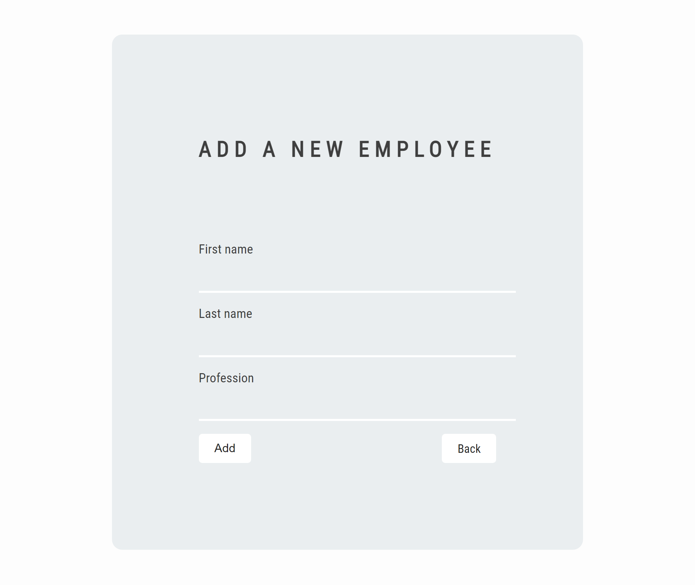
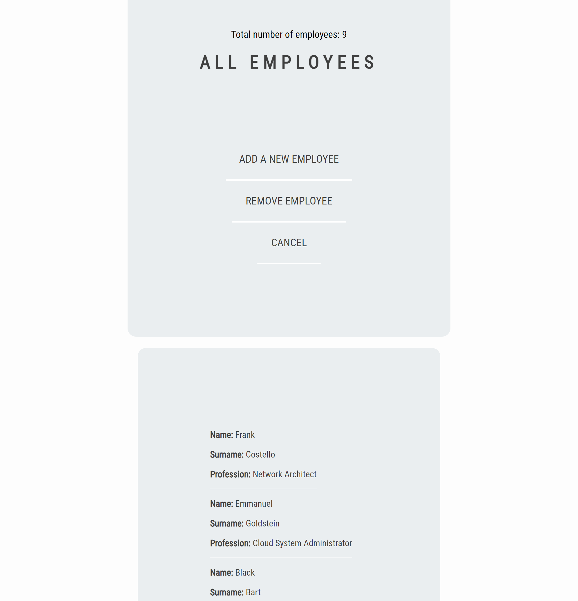
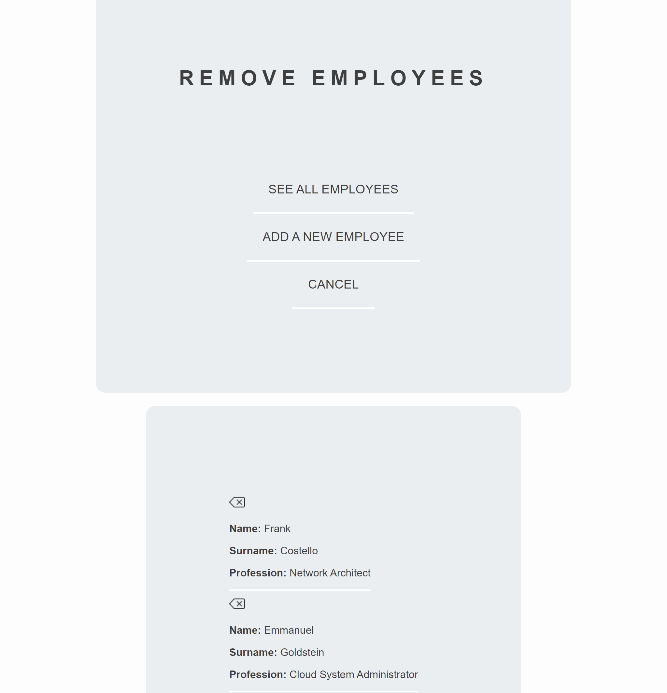

# Employess Data
### A straightforward application made for educational purposes, using procedural PHP and MySQL. The application shows the use of CREATE, READ and DELETE operations on the instance of an employee database.

# Setup
* Update the **inc/connect.php** file with your database credentials.
* Import the **employee_data.sql** file / database.

# Screenshots

***

* Create

***

* Read

***

* Delete

